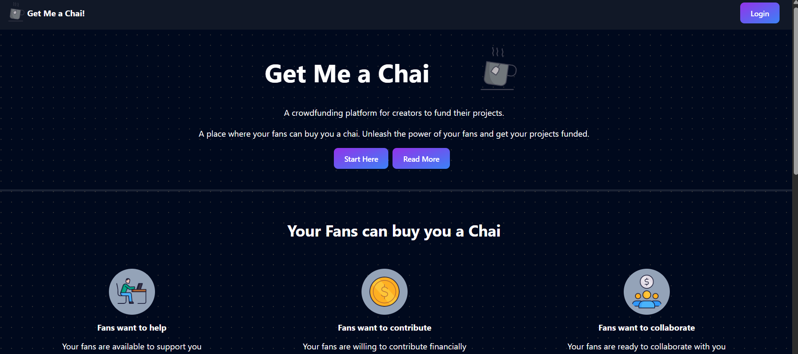
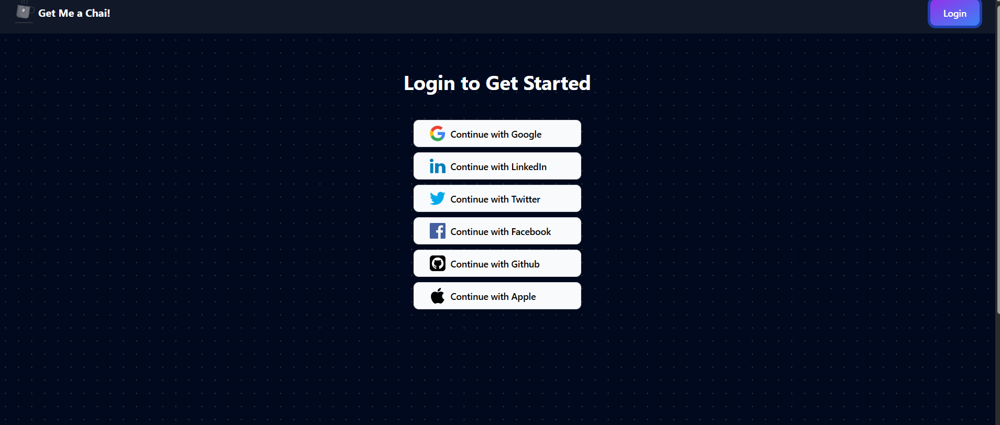
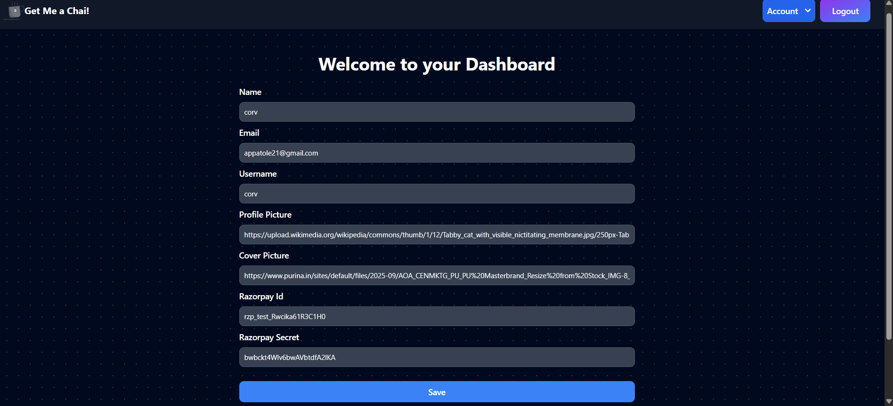
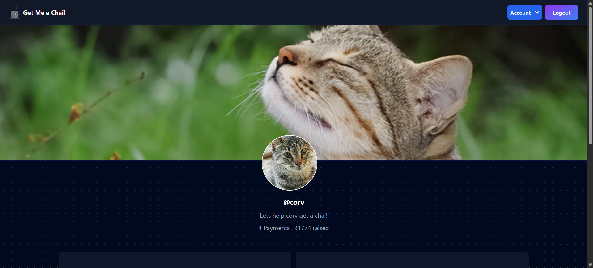
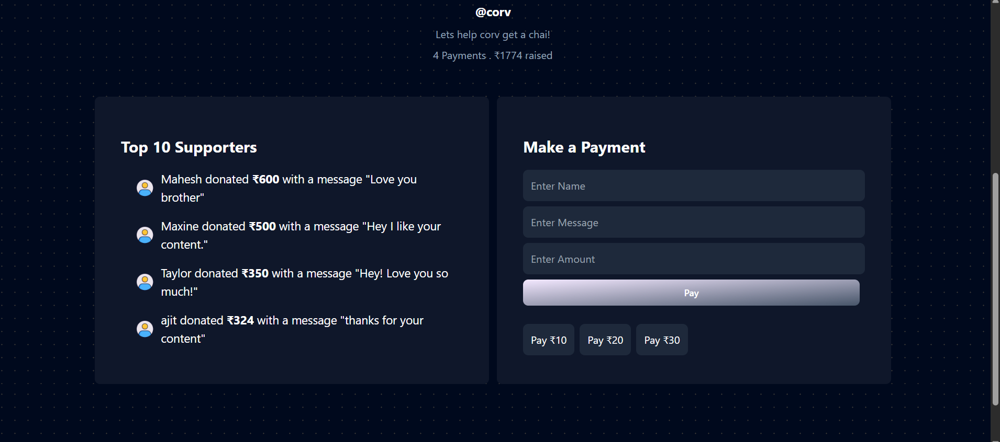
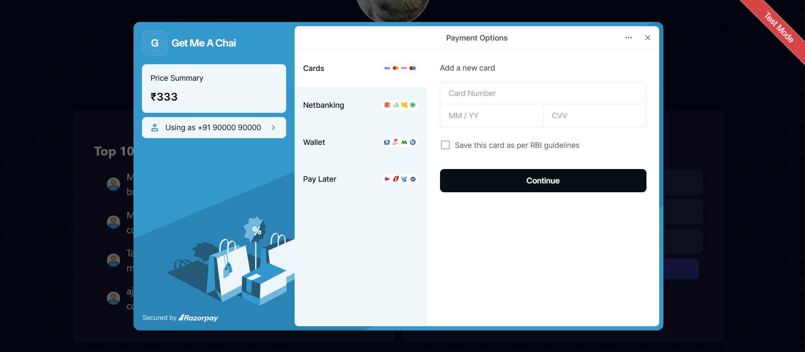

# ☕ GetMeAChai

A web application that allows users to support creators by buying them a chai (similar to Buy Me a Coffee).

## 🚀 Features

- User authentication
- Creator support system
- Payment integration
- Dashboard for creators
- Responsive UI

## 🛠️ Tech Stack

- Frontend: Next.js / React
- Backend: Node.js
- Database: MongoDB
- Authentication: NextAuth

## 📂 Installation

Clone the repository

```bash
git clone https://github.com/Aaditi-Patole/Get-Me-A-Chai.git
```

Go to project directory

```bash
cd GetMeAChai
```

Install dependencies

```bash
npm install
```

Run development server

```bash
npm run dev
```

Open in browser

```
http://localhost:3000
```

## 📸 Screenshots

### Homepage


### Login


### Dashboard


### Creater Page


### Payment Page




## 📌 Future Improvements

- Stripe payment integration
- Notifications
- Creator analytics

## 👩‍💻 Author

Aaditi Patole
